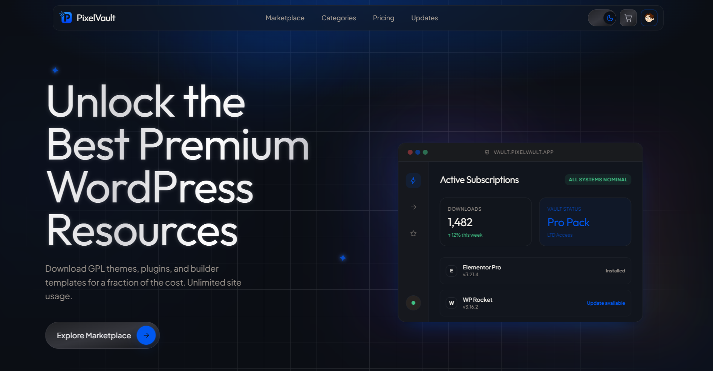

# PixelVault — Premium Digital Marketplace

PixelVault is a high-end, editorial-style marketplace for digital assets, specifically designed for WordPress plugins, themes, and creative assets. It features a refined aesthetic, secure authentication, and a robust administration backend.



## 🌟 Key Features

### **Security & Authentication**
- **Email Verification**: Mandatory security code verification during registration to ensure valid user bases.
- **Two-Factor Authentication (2FA)**: Secure login flow requiring an email verification code.
- **Secure Password Recovery**: Token-based password reset system with expiry protection and timezone synchronization.
- **Role-Based Access**: Distinct interfaces and permissions for Users and Administrators.

### **User Experience**
- **Premium Design**: Modern, responsive UI with glassmorphic elements, ambient mesh backgrounds, and smooth scroll animations.
- **Dark Mode Support**: Fully integrated dark mode with curated HSL color palettes.
- **Custom Avatars**: Users can choose from a set of premium 3D avatars or use initial-based fallbacks.
- **Fluid Shopping Cart**: Session-based cart system with smooth transitions and real-time count updates.

### **Administration**
- **Product Management**: Upload products (ZIP), manage versions, changelogs, and categories.
- **Order Tracking**: Real-time monitoring of transactions and customer activity.
- **Inquiry Management**: Centralized inbox for customer support and "Extra Download Quota" requests.
- **Security Controls**: Toggle platform-wide security settings and manage admin accounts.

## 🛠️ Tech Stack

- **Backend**: PHP 8.1+ (Vanilla MVC Architecture)
- **Database**: MySQL 8.0 / MariaDB
- **Frontend**: HTML5, Tailwind CSS (via Play CDN), Vanilla JavaScript
- **Styling**: Custom CSS variable system with dynamic HSL tokens
- **Email**: SMTP integration for all security and notification emails

## 🚀 Installation

1. **Clone the Repository**:
   ```bash
   git clone https://github.com/your-username/pixelvault.git
   ```

2. **Configure Environment**:
   Rename `.env.example` to `.env` and update your database and SMTP credentials:
   ```env
   DB_HOST=localhost
   DB_NAME=pixelvault
   DB_USER=root
   DB_PASS=your_password

   SMTP_HOST=smtp.example.com
   SMTP_PORT=587
   SMTP_USER=your_email
   SMTP_PASS=your_password
   ```

3. **Setup Database**:
   Import the [schema.sql](database/schema.sql) file into your MySQL database. You can also run the migration script:
   ```bash
   php database/migrate.php
   ```

4. **Web Server Configuration**:
   - **Apache**: The included `.htaccess` handles routing. Ensure `mod_rewrite` is enabled.
   - **PHP Development Server**:
     ```bash
     php -S localhost:8000
     ```

## 📸 Screenshots
Upload your screenshots (`ss1.png` and `ss2.png`) to the `/screenshots` directory to see them in this README.

---

Designed with ❤️ for digital creators.
